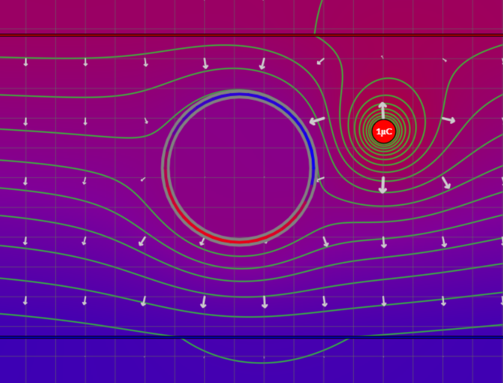
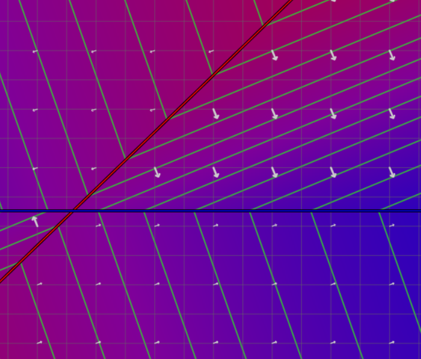
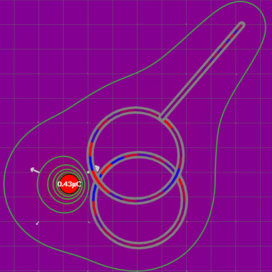

# [Interactive EM](https://benjamin-cates.github.io/Interactive-EM/)

The Interactive EM Webapp is a dynamic simulator for the electric field. This project was created as a part of [Friday Night Lab](https://fnlhub.com) at College of the Sequoias. The simulator is written in TypeScript and the graphics are in WebGL.

[Play with the project here](https://benjamin-cates.github.io/Interactive-EM/)

## Features
- Various charge shapes
    - Point charges
    - Infinite planes
    - Line charges
- Live property editor for physical features
    - Velocity
    - Angular velocity
    - Charge density
    - Size
    - Mass
- Variety of conductor shapes
- Equipotential lines
- Electric field vectors

## Example images

## Math
Simulating the electric field is a difficult task. Either it is computationally expensive, or requires hard integrals to be solved. We decided to solve integrals and present our math in a LaTeX document. The work-in-progress document can be [viewed here](https://www.overleaf.com/read/zzwffshvmbrb).

## License
This project is under the [MIT License](https://choosealicense.com/licenses/mit/). Feel free to fork and edit features (and maybe submit a pull request).